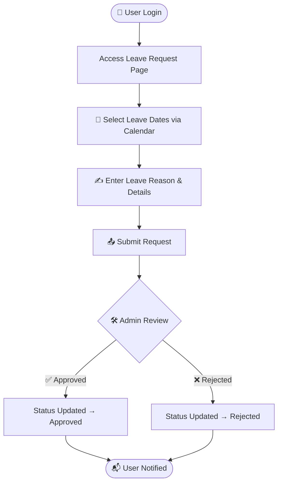

<picture>
  <source media="(prefers-color-scheme: dark)" srcset="https://capsule-render.vercel.app/api?type=transparent&color=gradient&customColorList=14&height=150&text=Leave%20Management%20System&fontSize=40&fontColor=a78bfa&animation=fadeIn&fontAlignY=55&desc=Student+LeaveRequest+Platform&descAlignY=78&descSize=16&descColor=94a3b8"/>
  
</picture>

https://github.com/user-attachments/assets/f1e1fbc4-0d8f-4e63-8b10-8a430962989c

 

---

## 🌟 Overview

<table>
<tr>
<td>

The **Leave Request Management System** is a modern, full-stack web application engineered to **digitize and automate** the entire leave management lifecycle — from request submission to admin approval.

Designed for organizations and educational institutions, this system eliminates cumbersome paperwork, accelerates processing, and provides complete visibility into leave activities for both employees and administrators.

**Core Problem Solved:**
Traditional leave processes are plagued by paperwork, miscommunication, and delays. This system replaces all of it with a clean, digital, role-based platform.

</td>
</tr>
</table>

---

## ✨ Key Features

| 🔐 Authentication | 📝 Leave Requests | 📆 Calendar | 🔄 Tracking | 🛠️ Admin Panel |
|:-----------------:|:-----------------:|:-----------:|:-----------:|:--------------:|
| Secure login | Digital submission | Interactive picker | Live status updates | Review & approve |
| Personalized dashboard | Duration selection | Visual scheduling | History records | Manage all users |
| Role-based access | Reason documentation | Easy date ranges | Status monitoring | Full control |

 

<b>🔐 User Authentication</b>

 

- Secure login and session management
- Personalized dashboard per user role
- Role-based experience — Employee vs Admin
- Protected routes and data access control

<b>📝 Leave Request Module</b>

 

- Submit leave applications entirely online
- Select leave duration via an interactive calendar
- Document reason and additional details
- Instant submission with confirmation

<b>🔄 Request Tracking</b>

 

- View all submitted applications in one place
- Real-time status: `Pending` → `Approved` / `Rejected`
- Complete leave history per user
- Transparent approval visibility

<b>🛠️ Admin Dashboard</b>

 

- View and manage all incoming leave requests
- One-click approval or rejection
- Full audit trail of leave decisions
- User leave activity overview

---

## 🖥️ Application Workflow

 

---

## 🛠️ Technology Stack

### Frontend

### Backend

### Database

### Development Tools

## 🔐 Security

| Security Layer | Implementation |
|:--------------|:--------------|
| 🔑 **Authentication** | Session-based secure login validation |
| 🛡️ **Database** | Parameterized queries to prevent SQL injection |
| ✅ **Input Validation** | Server-side and client-side form validation |
| 🔒 **Access Control** | Role-based permissions for User and Admin |

## 📈 Project Benefits

| Feature | Before | After |
|:--------|:------:|:-----:|
| Leave Application | 📄 Manual forms | ✅ Digital submission |
| Approval Process | 🐢 Days of delay | ⚡ Real-time processing |
| Record Keeping | 🗃️ Physical files | 🛢️ Secure database |
| Scheduling | 📅 Manual tracking | 🗓️ Visual calendar |
| Monitoring | ❌ No visibility | 📊 Live dashboard |
| Communication | 📞 Phone / in-person | 🔔 System notifications |

 

